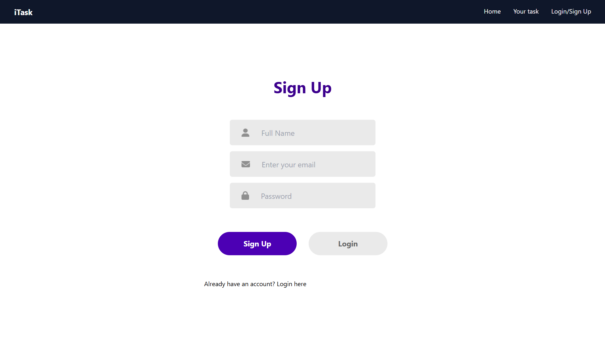
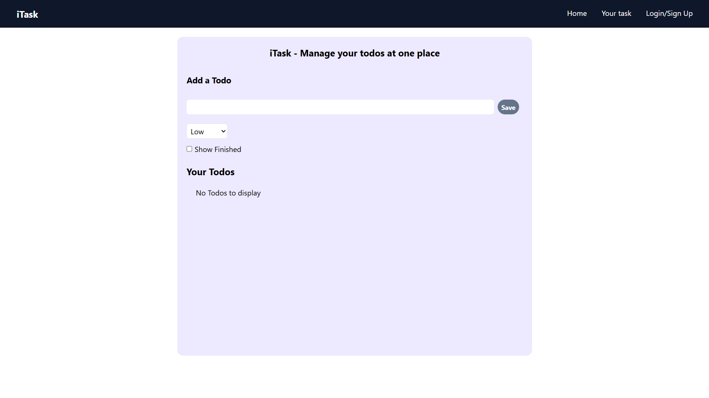
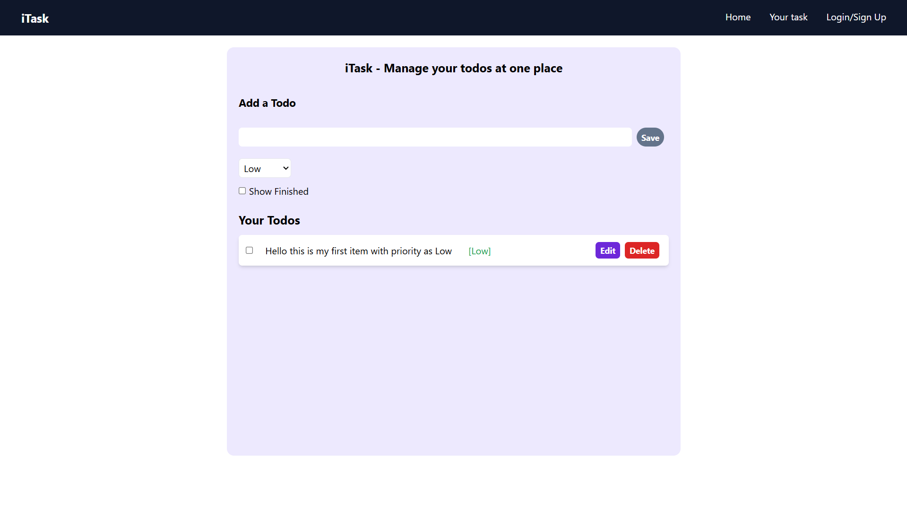
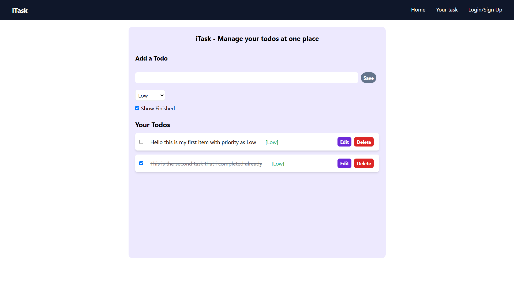
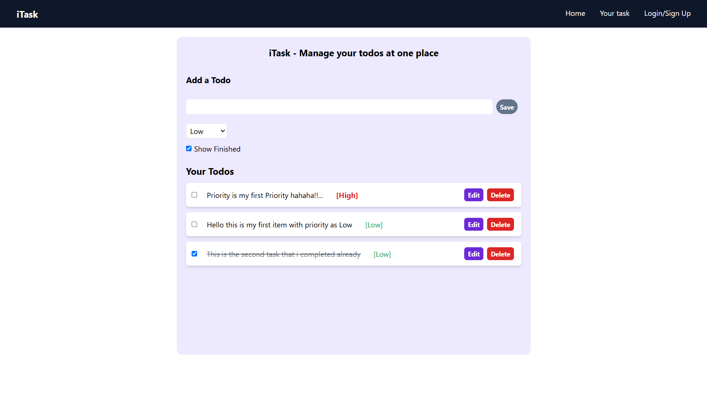

# 📌 To-Do App with Authentication

This is a React-based To-Do List application that includes user authentication (Sign Up & Login). Users can add, edit, delete, and mark tasks as completed. The app also supports setting task priorities (Low, Medium, High) and stores data in LocalStorage for persistence.

## 🚀 Features

✅ User Authentication (Sign Up & Login with LocalStorage)  
✅ Add, Edit, Delete To-Do Items  
✅ Mark Tasks as Completed  
✅ Show/Hide Completed Tasks  
✅ Set Task Priority (Low, Medium, High)  
✅ Persistent Data (Saved in LocalStorage)  
✅ Responsive UI with Tailwind CSS  

## 📸 Screenshots

1️⃣ Login & Signup Page 
  

2️⃣ To-Do List Dashboard  
  

3️⃣ Adding a New To-Do  
  

4️⃣ Marking a Task as Completed  
  

5️⃣ Setting Task Priority  
  


## 🛠️ Tech Stack

- React.js  
- Tailwind CSS  
- React Router  
- LocalStorage  

## 🔧 Installation & Setup

### 1️⃣ Clone the Repository:
```sh
git clone https://github.com/your-username/todo-app.git
cd todo-app
```

### 2️⃣ Install Dependencies:
```sh
npm install
```

### 3️⃣ Run the App:
```sh
npm start
```

## 📝 How It Works

### 🔹 Sign Up
- Enter an email and password  
- Details are stored in LocalStorage  
- Redirects to the Login Page after signup  

### 🔹 Login
- Check credentials from LocalStorage  
- If correct, redirects to Home Page  
- If incorrect, shows an error message  

### 🔹 Adding a To-Do
- Enter a task and click "Save"  
- Task is added to the list  
- Data is stored in LocalStorage  

### 🔹 Editing & Deleting Tasks
- Click "Edit" to modify a task  
- Click "Delete" to remove a task  
- Updates LocalStorage automatically  

### 🔹 Marking as Completed
- Click the checkbox to mark/unmark tasks  
- Completed tasks get a strikethrough style  
- Use "Show Finished" checkbox to toggle view  

### 🔹 Setting Priority
- Select "Low", "Medium", or "High" for each task  
- Tasks are highlighted based on priority  

## 📬 Contribution

Feel free to fork this repo, raise an issue, or submit a pull request to contribute. 😃

## ⭐ Show Some Love

If you like this project, leave a star ⭐ on GitHub!

## 🔗 Connect with Me

GitHub: [your-github](https://github.com/Balveer-saini)  
LinkedIn: [your-linkedin](https://linkedin.com/in/balveersaini/)  
